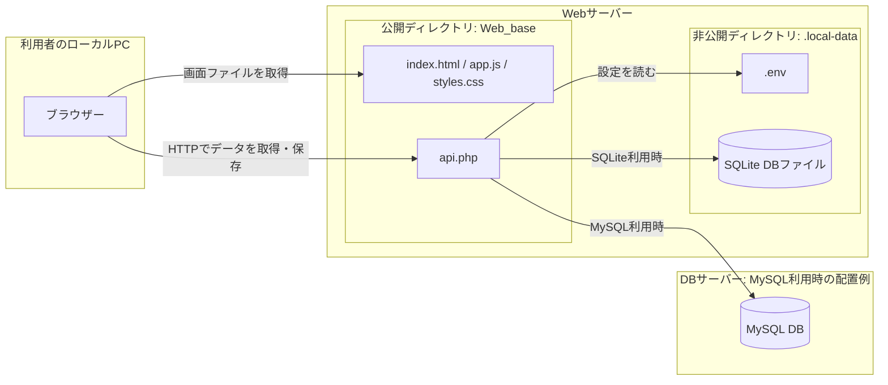
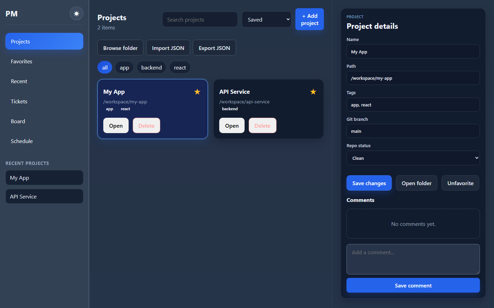
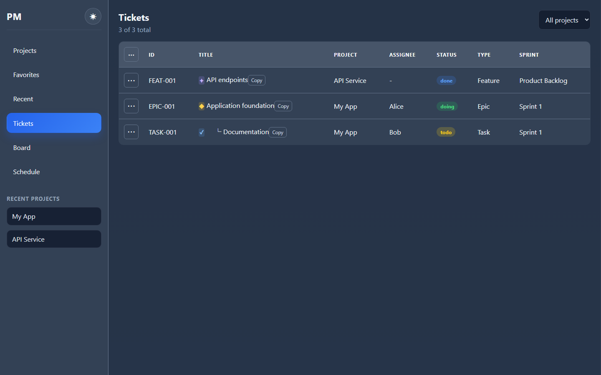
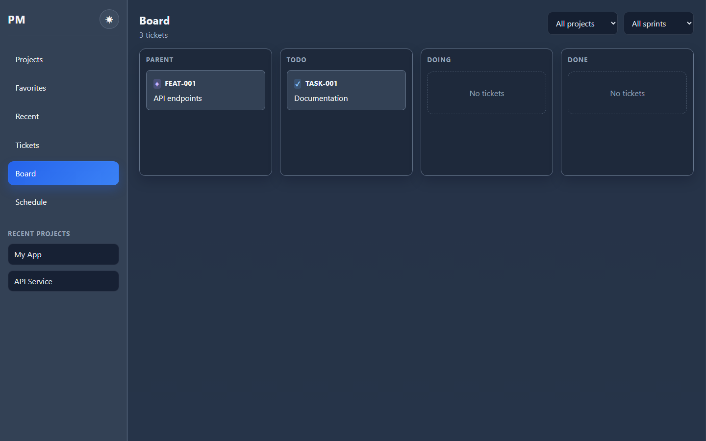
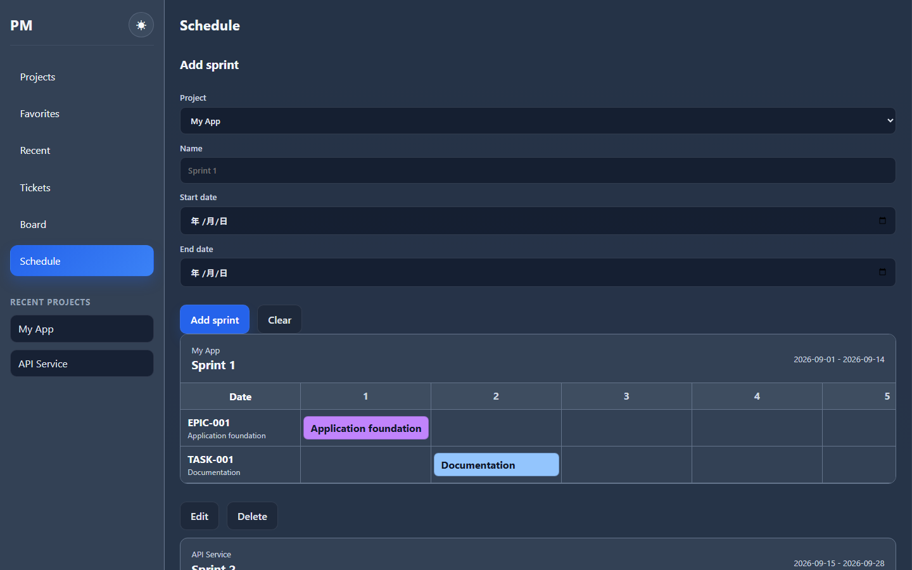

# Project Manager Web

## こんなことで困っていませんか？

- お客さんによってプロジェクト管理ツールが異なる
- そもそもプロジェクト管理ツールがない
- 開発メンバーに「○○って対応した？」と何度も同じことを聞いてしまう
- 「後で対応しよう」としていたタスクが、落ち着いたときに記憶から消えている
- 「この半年って何をしてたっけ？」と振り返ったとき、面談で話す内容がない

## このアプリで解決できます

このプロジェクト管理ツールは無料で利用でき、上記の問題をチケット管理でまとめて解決します。

チケットに担当者、ステータス、スプリント、開始日、終了日、親子関係を記録できるため、誰が何を対応しているかを一覧で確認できます。対応予定のタスクも記録に残るので、後回しにした作業を忘れません。チケットとスプリントの履歴を見返せば、過去の活動を整理し、面談や報告の材料として活用できます。

お客さんごとに異なるツールを使い分ける代わりに、自分の作業を一つの無料ツールで管理できます。

PHP経由でデータを保存する、Node.js不要のプロジェクト管理Webアプリです。
フロントエンドは静的HTMLとブラウザー側JavaScript、バックエンドはPHP APIで構成されています。

## 構成図



ブラウザーは利用者のPCで動き、画面ファイルとPHP APIはWebサーバーに置きます。SQLiteを選ぶ場合、DBファイルはWebサーバー内の非公開ディレクトリに保存されます。MySQLを選ぶ場合はDBサーバーに接続します。`.env` もWebサーバー内の非公開ディレクトリに置きます。ローカル開発では、ブラウザーとWebサーバーを同じPCで動かせます。MySQLも同じPCに配置できます。

## 技術選定とメリット

| 技術・構成 | 採用した理由とメリット |
| --- | --- |
| HTML・CSS・ブラウザー標準のJavaScript | 画面を少ないファイルで構成でき、ビルドなしでPHPサーバーから配信できます。実行時にNode.jsやnpmは不要です。 |
| PHP 8.1以上 | 画面からの取得・保存要求を `api.php` にまとめられます。PHPが使えるWebサーバーで動かせます。 |
| PDO | SQLiteとMySQLへの接続・書き込みを同じPHP APIから扱えます。DBの選択は設定で切り替えられます。 |
| SQLite | ローカル利用では別のDBサーバーを用意せず、ファイルとしてデータを保存できます。 |
| MySQL | 既存のMySQLサーバーを利用する環境では、アプリとDBを別の場所に配置できます。 |
| `.env` と非公開ディレクトリ | DBの接続設定をコードから分け、設定ファイルとSQLite DBを公開ディレクトリの外に置けます。 |

## 画面と使い方

以下の画面例は、付属のサンプルデータを表示したものです。

### 1. プロジェクトを登録・確認する



左の **Projects** でプロジェクト一覧を開きます。**Add project** で追加し、検索欄やタグで絞り込めます。カードを選ぶと右側に詳細が表示され、名前・パス・タグなどを編集して **Save changes** で保存できます。星印でお気に入りに登録できます。

### 2. チケットを一覧で確認する



左の **Tickets** では、チケットのID、タイトル、担当者、ステータス、種類、スプリントを一覧できます。右上の選択欄でプロジェクトを絞り込めます。表の左上にある **⋯** からチケットを追加でき、各行の **⋯** から既存チケットを操作できます。

### 3. ボードで進捗を見る



左の **Board** はチケットを **Parent / Todo / Doing / Done** に分けて表示します。右上でプロジェクトとスプリントを絞り込めます。カードをドラッグするとステータスを変更できます。

### 4. スプリントの日程を見る



左の **Schedule** でプロジェクト、スプリント名、開始日、終了日を入力し、**Add sprint** で登録します。下の日程表では、期間内のチケットを日付に沿って確認できます。

## 必要なもの

- PHP 8.1以上
- SQLiteを使う場合: PDO SQLite拡張
- MySQLを使う場合: PDO MySQL拡張とMySQLサーバー

Node.js、npm、Viteは実行時には必要ありません。

## 起動方法

`Web_base` フォルダーでPHPの開発サーバーを起動します。

### Windows / XAMPP

```powershell
cd Web_base
C:\xampp\php\php.exe -S 127.0.0.1:8001
```

ブラウザーで次のURLを開きます。

```text
http://127.0.0.1:8001/index.html
```

PHPがPATHに登録されている場合は、次のコマンドでも起動できます。

```powershell
php -S 127.0.0.1:8001
```

## DB設定

設定はプロジェクト直下の `.local-data/.env` に記載します。APIは起動時にこのファイルを読み込みます。`.local-data` は公開ディレクトリ `Web_base` の外に置いてください。

### SQLite: ローカルテスト用

```env
DB_DRIVER=sqlite
DB_PATH=./project_manager.sqlite
```

SQLiteのデータベースファイルは `.local-data/project_manager.sqlite` に作成されます。相対パスの `DB_PATH` は `.local-data` を基準に解決します。

### MySQL: 本番・共有環境用

```env
DB_DRIVER=mysql
DB_HOST=127.0.0.1
DB_PORT=3306
DB_NAME=project_manager
DB_USER=root
DB_PASS=
```

MySQLを使う場合は、先に `project_manager` データベースを作成してください。APIが必要な `app_state` テーブルを自動作成します。

`.local-data` はGit管理対象外です。`Web_base` をWebサーバーの公開ディレクトリに設定し、プロジェクト直下は公開しないでください。

## API

APIのエンドポイントは `api.php` です。

主なGETアクション:

```text
api.php?action=projects
api.php?action=tickets
api.php?action=sprints
api.php?action=recent
```

主なPOSTアクション:

```text
api.php?action=save-projects
api.php?action=save-tickets
api.php?action=save-sprints
api.php?action=save-recent
```

POSTデータは次の形式で送信します。

```json
{
	"data": []
}
```

## 主な機能

- プロジェクトの追加、編集、削除、検索、タグ絞り込み
- お気に入り、最近開いたプロジェクト、並べ替え
- プロジェクト情報とコメントの保存
- チケットの追加、編集、削除
- チケットの親子階層とドラッグ＆ドロップ並べ替え
- チケットタイプ別アイコン
- ステータス表示の色分け
	- todo: 黄
	- doing: 緑
	- done: 青
- BoardのParent / Todo / Doing / Done表示
- Boardでのステータス移動とダブルクリック編集
- スプリントの追加、編集、削除
- スプリント日程のカレンダー表示
- JSONインポート／エクスポート
- ダーク／ライトテーマ

## 主なファイル

```text
Web_base/
	index.html          静的HTMLのエントリーポイント
	app.js              画面描画、操作、API呼び出し
	api.php             PHP APIとDBアクセス
	../.local-data/.env DB設定（公開ディレクトリ外、Git管理対象外）
	src/styles.css      画面スタイル
```
